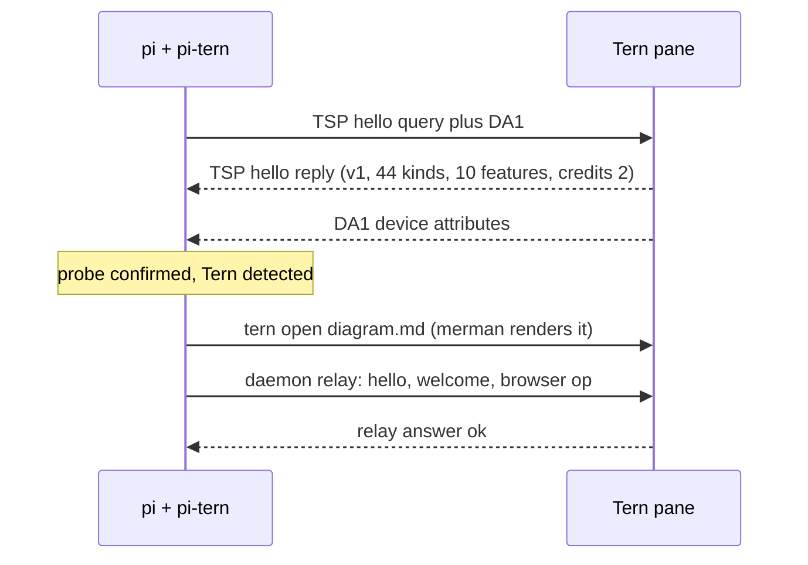

# pi-tern

[](https://github.com/Ghost-9/pi-tern/actions/workflows/ci.yml)
[](https://www.npmjs.com/package/pi-tern)
[](LICENSE)
[](https://github.com/Ghost-9/pi-tern/actions/workflows/ci.yml)

Tern integration for the [pi coding agent](https://github.com/earendil-works/pi).

[pi](https://github.com/earendil-works/pi) is a terminal coding agent. [Tern](https://stencil.so/tern) is a terminal by Stencil Labs that renders native UI for programs that speak the **Tern Surface Protocol (TSP)**: Mermaid diagrams, a WKWebView browser, native session surfaces. Programs that do not speak TSP are plain terminal panes.

This extension makes pi Tern-aware without patching pi:

- runs the TSP `hello` handshake, so pi knows it is inside Tern and what Tern supports;
- renders Mermaid through Tern's built-in engine (merman) in a file block;
- drives Tern's built-in browser as a picture-in-picture and captures PNGs the model can see;
- captures panes and mirrors the conversation into a Markdown block;
- keeps the tab title live (`π <model> · <context> · <dir>`) and can ring Tern's attention bell.

The extension itself never writes TSP frames, so pi's renderer is not disturbed — that is a deliberate boundary, since pi-tui's frames are multi-write synchronized-output transactions and a second writer tears them.

**Native surfaces are a separate opt-in path**, shipped in v1.0.0 and reached through the `pi-tern` *launcher* rather than the extension: the launcher probes Tern, and only when Tern has confirmed it is in an **agent block** does it run pi through a loader hook that hands rendering to Tern. Native mode is the special case, not the default — in a shell block, outside Tern, or with `-p` / `--mode json|rpc`, it runs stock pi. See [Native surfaces need an agent block](#native-surfaces-need-an-agent-block-not-a-shell-block) and [`docs/NATIVE-FINDINGS.md`](docs/NATIVE-FINDINGS.md).

## Features

| Feature | Status | What it does |
| --- | --- | --- |
| TSP handshake | stable | Sends `hello` + DA1 on the pty and reads the reply through pi's raw input. Verified against Tern **0.5.1**, whose reply advertises 44 node kinds and 10 features. That is *Tern's* vocabulary, not pi-tern's usage — pi-tern gates on three of them (`image`, `chart`, `aside`) and emits six node kinds |
| Mermaid diagrams | stable | `tern_diagram` / `/tern diagram` opens a file block rendered by Tern's merman engine (18 diagram types, including `xychart-beta` bar/line charts). `--last` uses the newest fence in the conversation; `pin` keeps one path so re-renders update the same block |
| Charts | stable | `tern_chart` draws bar/hbar, line, area, pie and donut from plain data as a themed SVG that Tern renders as a native image block. `png: true` rasterizes it locally so the model can read the chart back. Value labels keep full precision |
| Fleet panes | stable | `tern_fleet` treats a Tern pane as a thread: `spawn` (a `pi -p` task, an interactive pi, or any command) · `list` with liveness · `send` to steer · `read` · `wait` · `stop` · `prune`. Task text goes through a file, so prompts cannot break the shell. Panes are spawned with `--keep-open` so a finished task's output survives; `prune` closes those that exited and have been idle past a floor (default 30m), reporting why it kept each one it did not touch. `dryRun: true` first |
| Git worktrees | stable | `tern_worktree` list/create/remove/prune/status with dirty counts and optional `startFromOrigin`. Pure git — works with no Tern at all |
| Pull requests | stable | `tern_pr` summary (checks collapsed to counts plus failing names, plus a one-line verdict), list, comments, `watch` (`gh pr checks --watch` in a visible pane), open in Tern's browser |
| Capability contract | stable | `tern_status { manifest: true }` / `/tern capabilities`: one machine-readable document listing every capability, whether it is available here, and why not |
| Runnable shell blocks | stable | `tern_run` / `/tern run [--last]` runs a bash/sh command from the conversation in a visible Tern pane, waits for exit and returns the captured output (`PI_TERN_RUN=0` disables) |
| Session mirror | stable | `/tern mirror on` writes this conversation to `session-mirror.md` and opens it as a Tern block; a session TOC, timestamps and tool lines are included, and Mermaid inside it renders natively |
| Data plane | stable | `tern_db` (SQLite read-only by default), `tern_doc` (live documents, unsaved edits, heading-aware edits), `tern_board` (native task board lanes/cards) through Tern's own window APIs via the pi-bridge mailbox |
| Carly integration | stable | `tern_carly` + `/tern ask\|remember\|recall\|schedule\|tasks\|cancel`; a `pi_tern()` export lets Carly read pi's status. Carly uses remote providers: never send vault/secret material |
| Notebooks & settings | experimental | `tern_notebook read <pane>` for open notebook blocks (execution is not exposed by Tern's plugin API); `tern_settings get\|list\|describe` |
| Tern browser | stable | `tern_browser` drives Tern's WKWebView picture-in-picture: `open`, `state`, `snapshot`, `act`, `eval`, `capture` (returns an image), `input`, `goto`, `nav`, `events`, `close` |
| Pane inspection | stable | `tern_capture` (text, ANSI, HTML, scrollback, surfaces), `tern_panes`, `tern_ctl` |
| Pane events | stable | `tern_watch` waits for daemon events (`pane_exited`, …) with an optional pane filter, so pi can wait for a test run or server instead of polling |
| Pane output waits | stable | `tern_watch --expect <regex>` polls a pane until it prints a pattern (dev servers, builds) and returns the tail |
| Browser suite | stable | relay/CLI ops, stale-ref recovery, named PNG baselines, network capture (Resource Timing HAR-lite), PDF export, multi-tab listing/close, form-field helper |
| pi-bridge canvas | experimental | linked automatically on the first Tern session — installing pi-tern is enough; renders a native Markdown dashboard with a session TOC and recent activity (`ctrl+shift+f10`); `PI_TERN_BRIDGE=0` disables |
| Golden shots | stable | `tern_shot` renders scenario files to PNG + layout JSON (`tern shot`) |
| UI test harness | stable | `tern_ui_test` / `/tern ui-test <scenario> [expect]` runs a scenario and asserts against a control endpoint |
| Diagram pipelines | stable | `--from "<cmd>"` renders mermaid from a command's output; `git` renders the repo as a gitGraph |
| Credential guard | stable | `tern_db` refuses credential-looking tables and agent/models stores unless `allowSecret:true` |
| Remote hosts | stable | `tern_remote` lists or discovers Tern remote hosts |
| Diagnostics | stable | `tern_diagnose` and `/tern diagnose`: environment, probe, relay round trip, control endpoint, persisted state |
| Control endpoint | stable | `/tern control [window|headless]` starts a Tern window or headless session with a control socket; `tern_ctl` uses it automatically |
| Restore | stable | `/tern restore` reopens the session mirror and the last pinned diagram; state survives Tern/pi restarts |
| Live tab title | stable | `π <model> · <context> · <dir>`, refreshed after startup and on every turn |
| Attention bell | opt-in | `PI_TERN_BELL=1` rings Tern's bell when pi finishes a turn |
| Native Tern surfaces | opt-in | Tern owning the transcript/composer/dock. Reached through the `pi-tern` launcher, not the extension: pi runs under a loader hook that hands rendering to Tern. Only in an **agent block**, and only inside Tern — see [Limitations](#limitations) |

## Requirements

- **Tern 0.5.0 or newer**, running (closed beta; a Stencil account comes from Tern itself). Developed and gated against **0.5.1**; 0.4.5 was the floor when the extension first shipped and is no longer what the tests run against.
- pi 1.0.x
- macOS or Linux. **Not functional inside tmux, screen or zellij:** those swallow APC strings, so the TSP handshake never completes and the pane-only features stay inert. The CLI-backed tools (`tern_chart`, `tern_worktree`, `tern_pr`) do not depend on the handshake and keep working.

### Do I need to run pi *inside* Tern?

No. Only the pane-scoped features do (TSP probe, live tab title, relay push, native
surfaces). Everything else needs just a running Tern daemon, so a **pi-tern tool from a
T3-hosted agent, a cron job or a plain terminal** can still open diagrams and charts in the
Tern window, drive Tern's browser, run and capture panes, spawn fleet panes, and manage
worktrees and PRs. That is what `/tern capabilities` reports per feature, with a reason when
a feature is unavailable here.

### Native surfaces need an **agent block**, not a shell block

This is the one thing that will look broken if you get it wrong. Tern displays a TSP surface only in
an **agent** block. Started in a **shell** block, pi-tern's frames are accepted and the surface
materialises — but nothing is ever drawn, so the pane is **blank**, with no error anywhere to read.

```
agent block  →  pi's transcript, composer and status render as Tern surfaces   ✔
shell block  →  blank pane, no error, no clue                                  �’
```

So either:

1. **Open an agent block deliberately** — Tern's palette can create one beside the focused pane, or
2. **Run `/tern agent-setup` inside pi.** It writes the two settings Tern documents for this, after
   backing up the file, and reports exactly what changed:

   | Key | Tern's description | Value |
   | --- | --- | --- |
   | `new_blocks` | "what new tabs and splits open" | `"Agent"` |
   | `agent_command` | "what a block runs: the login shell, or this" (defaults to `omp`) | the pi-tern launcher |

   Or set them by hand:

```jsonc
// ~/Library/Application Support/Tern/settings.json
{ "agent_command": "/Users/you/bin/pi-tern", "agent_placement": "split" }
```

And you can verify which kind you are in: `/tern doctor` reports the block kind, and pi-tern warns
when it detects a shell block.

> **Since 1.1.5 pi-tern detects this and recovers.** At session start it asks the `pi-bridge` plugin
> what kind of block it is in; if it is not an agent block it hands the terminal back to pi's own
> interface and tells you why, instead of leaving a blank pane. `PI_TERN_SKIP_KIND_CHECK=1` disables
> the check. The kind is only exposed to a window plugin (`cx.session:panes()`), which is why the
> check goes through the mailbox — `tern inspect --json` carries client kinds only, and
> `tern whoami` carries just the identity chain.

## Install

```bash
pi install git:github.com/Ghost-9/pi-tern
```

or

```bash
pi install npm:pi-tern
```

Manual install:

```bash
git clone https://github.com/Ghost-9/pi-tern ~/.pi/agent/extensions/pi-tern
```

Reload pi, then check inside a Tern pane:

```bash
pi
/reload
/tern doctor
```

## Usage

Commands:

```
/tern doctor                  probe result, hello kinds, features, credits
/tern diagnose                environment, relay and control diagnostics
/tern run [--last] <command>  run a shell command in a visible Tern pane
/tern db <path> <sql>        query SQLite through Tern's engine (read-only)
/tern doc <action> <path>    read/outline/search/append/write a Tern document
/tern board read <path>      read a native Tern board
/tern ask|remember|recall <text>   talk to Carly (remote providers; no vault content)
/tern schedule <when> | <title> · tasks · cancel <id>
/tern settings get|list|describe <key>
/tern notebook read <pane>   read an open notebook block
/tern notebook run <path>    execute a notebook via nbconvert in a visible pane
/tern ui-test <scenario> [expect]  shot + control-endpoint assertions
/tern diagram git [dir]      render the repository history as a gitGraph
/tern diagram --from "<cmd>" render mermaid printed by a command
/tern mirror search <text>   search the session mirror
/tern restore                 reopen the mirror and the last pinned diagram
/tern control [window|headless]  start a control endpoint for tern_ctl
/tern bridge install|refresh|status  install the pi-bridge Tern canvas
/tern diagram <mermaid>       render a diagram through Tern's merman engine
/tern diagram --last [--pin]  render the newest Mermaid fence in the conversation
/tern mirror on|off|open      mirror the conversation into a Markdown block
/tern browser {"op":"open","url":"…"}
/tern capture [block]         print a pane's visible text
/tern panes                   list sessions, tabs and blocks as JSON
/tern title | bell            apply the title, or ring the bell once
```

Model-callable tools: `tern_status`, `tern_run`, `tern_browser` are declared; `tern_diagram`, `tern_capture`, `tern_panes`, `tern_ctl`, `tern_mirror`, `tern_watch`, `tern_diagnose`, `tern_shot`, `tern_remote`, `tern_bridge`, `tern_db`, `tern_doc`, `tern_board`, `tern_carly`, `tern_notebook`, `tern_settings`, `tern_ui_test` are deferred and callable from codemode scripts by name (listed in `tern_status`).

Examples:

```
Draw the architecture as a Mermaid diagram and open it in Tern.
Open https://example.com in Tern's browser, snapshot it, click the first link and capture a screenshot.
Start a session mirror so I can read this conversation natively.
```

## Configuration

| Variable | Default | Effect |
| --- | --- | --- |
| `PI_TERN_PROBE` | `1` | `0` skips the TSP hello probe |
| `PI_TERN_TITLE` | `1` | `0` stops title updates |
| `PI_TERN_BELL` | `0` | `1` rings the bell at agent end |
| `PI_TERN_MIRROR` | `0` | `1` starts the session mirror automatically |
| `PI_TERN_DIAGRAM_AUTO` | `0` | `1` auto-opens Mermaid blocks found in replies |
| `PI_TERN_RELAY` | `1` | `0` uses the `tern browser` CLI instead of the daemon relay |
| `PI_TERN_RUN` | `1` | `0` disables the `tern_run` tool |
| `PI_TERN_BRIDGE` | `1` | `0` skips the automatic pi-bridge link |
| `PI_TERN_FORCE` | — | `1` tries Tern features outside a Tern pane |

## Prompt footprint

Only three tools are declared to the model — `tern_status`, `tern_run`, `tern_browser`. The other
sixteen are `deferred`: they do not appear in the prompt and are callable from codemode scripts by
name (the names are listed in `tern_status`). Measured cost of the whole extension: **+774 prompt
tokens** (21,704 → 22,478), down from +1,309 in 0.8.0 and +3,679 in 0.7.0. See
[docs/BENCHMARKING.md](docs/BENCHMARKING.md).

## How it works



Three channels, kept separate:

1. **pty / TSP** — the `hello` probe only. The extension does not open surfaces or send frames.
2. **Tern daemon relay** (`$TERN_PANE_SOCKET`) — the browser. Frames are `u32LE length + UTF-8 JSON`; falls back to the `tern browser` CLI.
3. **`tern` CLI** — `open` for diagrams and the mirror, `capture`, `ls --json`, `ctl`.

`docs/ARCHITECTURE.md` has the module map and the probe lifecycle.

## Limitations

- **Native mode is opt-in and best-effort; the extension half is the supported half.** pi-tui's ANSI
  frames are multi-write synchronized-output transactions with private cursor accounting, so a second
  writer tears them — which is why the *extension* never writes TSP frames. Native surfaces instead
  run through the `pi-tern` launcher's loader hook, which depends on pi's internals and is rebased
  per pi release. The split is deliberate and documented: extension = stable and supported; native =
  opt-in. Outside Tern, in a shell block, or with `-p`/`--mode json|rpc`, native mode falls back to
  stock pi rather than failing.
- **Tern's agent layer is omp-keyed.** `cx.agents:transcript` reads the `omp.session` surface and returns `{}` for non-omp programs, so the Agent chip, Carly transcripts and prompt injection are unavailable. Tern 0.5.1 adds Hermes as a second native agent that *speaks omp's chat vocabulary*, which suggests this is an implementable contract rather than an omp-only privilege — but the read-side predicate for a third agent is unconfirmed, and impersonating `omp.session` to reach it is deliberately not attempted.
- **Tern file blocks are not panes.** `tern capture` cannot read a file block back (`no such pane in this session daemon`), so diagram rendering is verified visually.
- **A running Tern daemon is not the same as the new Tern binary.** The session daemon survives an app
  update by design, so after updating Tern, `tern --version` can report the new build while the live
  daemon still answers with the old one (observed: binary 0.5.1, hello `ver: "0.5.0"`). Restart the
  daemon or the app before attributing any behaviour change to a version bump.
- **Native surfaces are agent-block-only** (see above). In a shell block the pane is blank and nothing
  reports an error; 1.1.5 detects it and falls back, earlier versions did not.
- **Browser capture needs a rendered picture-in-picture.** Tern answers `capture: a 0×0 px image is out of range` while the PiP is not visible. `tern_chart` sidesteps this for SVG charts by rasterizing locally (`rsvg-convert` → `inkscape` → `qlmanage` → browser); for HTML/JS pages the browser is still the only renderer.
- **Inline figures in the conversation are opt-in and unconfirmed.** `PI_TERN_INLINE_IMAGES=1` only *attempts* it; every rejection lands in `nativeState().lastError`. The mechanism is settled: there is **no `blob` frame op** — Tern answers `unknown op blob` for both `["blob",id,mime,data]` and `["blob",mime,data]`, and the blob store is a plugin-VM API (`blob(self, bytes, mime)`), not part of the frame dialect. pi-tern therefore sends the bytes **inline in the `image` node**, which Tern accepts. The accepted encoding is not the same as *seen rendering*: use the file block or `png: true` for anything that must work today. Full table in [`docs/TSP-ENCODINGS.md`](docs/TSP-ENCODINGS.md).
- **The TSP handshake is a race and is retried.** Three attempts with backoff, because on identical
  panes one probe received Tern's 633-byte reply immediately while another received nothing across
  six retries over 2.4 s. A single 700 ms attempt fails nondeterministically, which is why native
  mode used to engage only sometimes. `/tern diagnose` now reports `probeFailure` — `timeout` (a
  lost race), `no-hello-reply` (the terminal answered the DA1 sentinel but does not speak TSP), or
  `unexpected-reply:…` — instead of failing silently. Tune with `PI_TERN_PROBE_ATTEMPTS` and
  `PI_TERN_PROBE_TIMEOUT_MS`.
- **`tern_ctl` needs a control endpoint.** Run `/tern control` (headless by default) or launch Tern with `--control EP` / set `TERN_WINDOW_SOCKET`.
- **The pi-bridge canvas is experimental.** The plugin loads and binds its chord (verified in Tern's log and `plugin list`), but the Luau canvas rendering itself has not been visually verified from CI.
- **`tern_watch --expect` is event-driven.** It subscribes once to `tern events` rather than starting
  a `tern capture` process every 500 ms, and falls back to backing-off polls if events do not flow.
  The reply reports `via: "events"` or `via: "poll"`, so the fallback is visible.
- **Mailbox latency** is one plugin poll (~0.25–0.75 s per call); DB access is read-only unless `exec` is explicitly allowed; `agent.db`-style stores hold credentials, so pass explicit paths and never select secret columns.
- **Notebook execution is not exposed** by Tern's plugin API; `tern_notebook` only reads open notebook blocks.

## Security

pi extensions run inside the pi process with the same operating-system permissions. Read the source before installing, and only install from sources you trust.

- The session mirror is opt-in and writes to `~/.pi/agent/scratch/pi-tern/session-mirror.md`.
- The browser uses Tern's own WKWebView profile, including its cookies. Treat it as your logged-in browser context.
- The extension sends nothing anywhere; Tern is local.

Report vulnerabilities through the [private advisory form](https://github.com/Ghost-9/pi-tern/security/advisories/new).

## What is verified, and how

This section exists because of a specific failure. Releases 1.1.0–1.1.4 recorded native surfaces as
*"verified"* on the strength of **frame acceptance** — Tern answered with zero errors and the surface
tree came back from `capture --surfaces`. That method cannot tell a surface that *renders* from one
that *renders nothing*, and both statements are equally true of a blank pane. The result was a P0
that shipped: native mode removed pi's entire interface and showed nothing at all.

So the distinction is stated rather than assumed:

| Claim | How it is checked |
| --- | --- |
| **Frame accepted** | Tern's own error channel. Strong, but it is acceptance — *not* display. |
| **Layout rendered** | **Nothing has been verified this way, ever**, and it is currently impossible: surfaces display only in an agent block, and on Tern 0.5.1 every harness command that creates one times out after 20 s — for *any* command. `scripts/render-proof.mjs` runs on every gate and reports the measured answer (today: `BLOCKED`); `--require` makes it a failure. Treat every native render claim as unverified until that probe reports a displayed surface. Full detail and reproduction: [`docs/RENDER-PROOF.md`](docs/RENDER-PROOF.md). |
| **Works outside a Tern pane** | `scripts/verify.ts`, 19 live checks run deliberately from *outside* a pane — the property that makes pi-tern usable from another host. |
| **Never breaks stock pi** | `native/compat.mjs` — 7 checks locally, `--static` (4, no model call) in CI. Differential: the launcher's stdio must be shape-identical to stock pi's, with no TSP frame in either. |
| **Types are real** | `tsc --noEmit` under `strict`, against the actual pi and typebox types. `native/` is covered too, and `scripts/check-native-types.mjs` fails when a hand-written declaration names an export the module lacks. |

Run the whole thing with `npm run gate`. It prints a count per step and reports skips separately:
`GATE PASSED (7 run, 0 skip)` is not the same claim as `GATE PASSED (5 run, 2 skip)`.

## Development

```bash
npm install                 # dev dependencies, including the real pi + typebox types
npm test                    # the unit suite (96 tests), no Tern required
npm run test:live           # relay/browser test; needs a Tern pane
npm run typecheck           # strict, against the real pi types
npm run lint
npm run gate                # everything, including the live checks (~30 s)
npm run bench               # mailbox latency; needs a Tern pane with pi-bridge
```

The extension itself has **no runtime dependencies**: Node builtins, pi's APIs and TypeBox schemas
only. pi and typebox are devDependencies, used to typecheck against the real API.

To regenerate the Release pages from a new tag, `release.yml` now runs the full suite, typecheck,
lint, the declaration check and the static compat tier **before** publishing to npm, then creates the
Release. Every tag has a Release page, and `v1.1.2` carries a warning: it has a data-plane P0, fixed
in `v1.1.3`.

## Credits

- The Tern Surface Protocol is documented by Stencil Labs: <https://docs.stencil.so/tern/protocol/>. Tern is a Stencil Labs product.
- pi is by Earendil Works.
- The browser relay framing and op vocabulary were informed by [oh-my-pi](https://github.com/can1357/oh-my-pi) (MIT), the reference TSP client.
- Not affiliated with Stencil Labs or Earendil Works.

## License

[MIT](LICENSE) © 2026 Mayank Batra

**Native mode (v1.0.0):** run `pi-tern` instead of `pi` inside Tern for a native surface — transcript rows in `main`, a real TSP `editor` composer (Tern edit/undo/send drive pi), suspend/resume, opt-in surface adopt. Outside Tern or in `-p`/`--mode json|rpc`, it runs stock pi. See [`docs/NATIVE-FINDINGS.md`](docs/NATIVE-FINDINGS.md).
