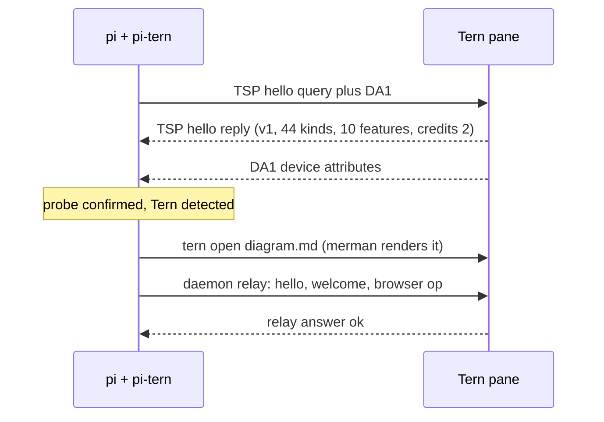

# pi-tern

[](https://github.com/Ghost-9/pi-tern/actions/workflows/ci.yml)
[](https://www.npmjs.com/package/pi-tern)
[](LICENSE)
[](https://github.com/Ghost-9/pi-tern/actions/workflows/ci.yml)

Tern integration for the [pi coding agent](https://github.com/earendil-works/pi).

[pi](https://github.com/earendil-works/pi) is a terminal coding agent. [Tern](https://stencil.so/tern) is a terminal by Stencil Labs that renders native UI for programs that speak the **Tern Surface Protocol (TSP)**: Mermaid diagrams, a WKWebView browser, native session surfaces. Programs that do not speak TSP are plain terminal panes.

This extension makes pi Tern-aware without patching pi:

- runs the TSP `hello` handshake, so pi knows it is inside Tern and what Tern supports;
- renders Mermaid through Tern's built-in engine (merman) in a file block;
- drives Tern's built-in browser as a picture-in-picture and captures PNGs the model can see;
- captures panes and mirrors the conversation into a Markdown block;
- keeps the tab title live (`π <model> · <context> · <dir>`) and can ring Tern's attention bell.

It never writes TSP frames, so pi's renderer is not disturbed. Native Tern surfaces (Tern owning pi's transcript, composer and dock) are out of scope for this version — see [Limitations](#limitations).

## Features

| Feature | Status | What it does |
| --- | --- | --- |
| TSP handshake | stable | Sends `hello` + DA1 on the pty and reads the reply through pi's raw input. Tern 0.4.5 answers with 44 node kinds and 10 features |
| Mermaid diagrams | stable | `tern_diagram` / `/tern diagram` opens a file block rendered by Tern's merman engine (18 diagram types, including `xychart-beta` bar/line charts). `--last` uses the newest fence in the conversation; `pin` keeps one path so re-renders update the same block |
| Charts | stable | `tern_chart` draws bar/hbar, line, area, pie and donut from plain data as a themed SVG that Tern renders as a native image block. `png: true` rasterizes it locally so the model can read the chart back. Value labels keep full precision |
| Fleet panes | stable | `tern_fleet` treats a Tern pane as a thread: `spawn` (a `pi -p` task, an interactive pi, or any command) · `list` with liveness · `send` to steer · `read` · `wait` · `stop`. Task text goes through a file, so prompts cannot break the shell |
| Git worktrees | stable | `tern_worktree` list/create/remove/prune/status with dirty counts and optional `startFromOrigin`. Pure git — works with no Tern at all |
| Pull requests | stable | `tern_pr` summary (checks collapsed to counts plus failing names, plus a one-line verdict), list, comments, `watch` (`gh pr checks --watch` in a visible pane), open in Tern's browser |
| Capability contract | stable | `tern_status { manifest: true }` / `/tern capabilities`: one machine-readable document listing every capability, whether it is available here, and why not |
| Runnable shell blocks | stable | `tern_run` / `/tern run [--last]` runs a bash/sh command from the conversation in a visible Tern pane, waits for exit and returns the captured output (`PI_TERN_RUN=0` disables) |
| Session mirror | stable | `/tern mirror on` writes this conversation to `session-mirror.md` and opens it as a Tern block; a session TOC, timestamps and tool lines are included, and Mermaid inside it renders natively |
| Data plane | stable | `tern_db` (SQLite read-only by default), `tern_doc` (live documents, unsaved edits, heading-aware edits), `tern_board` (native task board lanes/cards) through Tern's own window APIs via the pi-bridge mailbox |
| Carly integration | stable | `tern_carly` + `/tern ask\|remember\|recall\|schedule\|tasks\|cancel`; a `pi_tern()` export lets Carly read pi's status. Carly uses remote providers: never send vault/secret material |
| Notebooks & settings | experimental | `tern_notebook read <pane>` for open notebook blocks (execution not exposed by Tern 0.4.5); `tern_settings get\|list\|describe` |
| Tern browser | stable | `tern_browser` drives Tern's WKWebView picture-in-picture: `open`, `state`, `snapshot`, `act`, `eval`, `capture` (returns an image), `input`, `goto`, `nav`, `events`, `close` |
| Pane inspection | stable | `tern_capture` (text, ANSI, HTML, scrollback, surfaces), `tern_panes`, `tern_ctl` |
| Pane events | stable | `tern_watch` waits for daemon events (`pane_exited`, …) with an optional pane filter, so pi can wait for a test run or server instead of polling |
| Pane output waits | stable | `tern_watch --expect <regex>` polls a pane until it prints a pattern (dev servers, builds) and returns the tail |
| Browser suite | stable | relay/CLI ops, stale-ref recovery, named PNG baselines, network capture (Resource Timing HAR-lite), PDF export, multi-tab listing/close, form-field helper |
| pi-bridge canvas | experimental | linked automatically on the first Tern session — installing pi-tern is enough; renders a native Markdown dashboard with a session TOC and recent activity (`ctrl+shift+f10`); `PI_TERN_BRIDGE=0` disables |
| Golden shots | stable | `tern_shot` renders scenario files to PNG + layout JSON (`tern shot`) |
| UI test harness | stable | `tern_ui_test` / `/tern ui-test <scenario> [expect]` runs a scenario and asserts against a control endpoint |
| Diagram pipelines | stable | `--from "<cmd>"` renders mermaid from a command's output; `git` renders the repo as a gitGraph |
| Credential guard | stable | `tern_db` refuses credential-looking tables and agent/models stores unless `allowSecret:true` |
| Remote hosts | stable | `tern_remote` lists or discovers Tern remote hosts |
| Diagnostics | stable | `tern_diagnose` and `/tern diagnose`: environment, probe, relay round trip, control endpoint, persisted state |
| Control endpoint | stable | `/tern control [window|headless]` starts a Tern window or headless session with a control socket; `tern_ctl` uses it automatically |
| Restore | stable | `/tern restore` reopens the session mirror and the last pinned diagram; state survives Tern/pi restarts |
| Live tab title | stable | `π <model> · <context> · <dir>`, refreshed after startup and on every turn |
| Attention bell | opt-in | `PI_TERN_BELL=1` rings Tern's bell when pi finishes a turn |
| Native Tern surfaces | not included | Tern owning the transcript/composer/dock requires pi core changes |

## Requirements

- Tern 0.4.5 or newer, running (closed beta; a Stencil account comes from Tern itself)
- pi 1.0.x
- macOS or Linux. **Not functional inside tmux, screen or zellij:** those swallow APC strings, so the TSP handshake never completes and the pane-only features stay inert. The CLI-backed tools (`tern_chart`, `tern_worktree`, `tern_pr`) do not depend on the handshake and keep working.

### Do I need to run pi *inside* Tern?

No. Only the pane-scoped features do (TSP probe, live tab title, relay push, native
surfaces). Everything else needs just a running Tern daemon, so a **pi-tern tool from a
T3-hosted agent, a cron job or a plain terminal** can still open diagrams and charts in the
Tern window, drive Tern's browser, run and capture panes, spawn fleet panes, and manage
worktrees and PRs. That is what `/tern capabilities` reports per feature, with a reason when
a feature is unavailable here.

## Install

```bash
pi install git:github.com/Ghost-9/pi-tern
```

or

```bash
pi install npm:pi-tern
```

Manual install:

```bash
git clone https://github.com/Ghost-9/pi-tern ~/.pi/agent/extensions/pi-tern
```

Reload pi, then check inside a Tern pane:

```bash
pi
/reload
/tern doctor
```

## Usage

Commands:

```
/tern doctor                  probe result, hello kinds, features, credits
/tern diagnose                environment, relay and control diagnostics
/tern run [--last] <command>  run a shell command in a visible Tern pane
/tern db <path> <sql>        query SQLite through Tern's engine (read-only)
/tern doc <action> <path>    read/outline/search/append/write a Tern document
/tern board read <path>      read a native Tern board
/tern ask|remember|recall <text>   talk to Carly (remote providers; no vault content)
/tern schedule <when> | <title> · tasks · cancel <id>
/tern settings get|list|describe <key>
/tern notebook read <pane>   read an open notebook block
/tern notebook run <path>    execute a notebook via nbconvert in a visible pane
/tern ui-test <scenario> [expect]  shot + control-endpoint assertions
/tern diagram git [dir]      render the repository history as a gitGraph
/tern diagram --from "<cmd>" render mermaid printed by a command
/tern mirror search <text>   search the session mirror
/tern restore                 reopen the mirror and the last pinned diagram
/tern control [window|headless]  start a control endpoint for tern_ctl
/tern bridge install|refresh|status  install the pi-bridge Tern canvas
/tern diagram <mermaid>       render a diagram through Tern's merman engine
/tern diagram --last [--pin]  render the newest Mermaid fence in the conversation
/tern mirror on|off|open      mirror the conversation into a Markdown block
/tern browser {"op":"open","url":"…"}
/tern capture [block]         print a pane's visible text
/tern panes                   list sessions, tabs and blocks as JSON
/tern title | bell            apply the title, or ring the bell once
```

Model-callable tools: `tern_status`, `tern_run`, `tern_browser` are declared; `tern_diagram`, `tern_capture`, `tern_panes`, `tern_ctl`, `tern_mirror`, `tern_watch`, `tern_diagnose`, `tern_shot`, `tern_remote`, `tern_bridge`, `tern_db`, `tern_doc`, `tern_board`, `tern_carly`, `tern_notebook`, `tern_settings`, `tern_ui_test` are deferred and callable from codemode scripts by name (listed in `tern_status`).

Examples:

```
Draw the architecture as a Mermaid diagram and open it in Tern.
Open https://example.com in Tern's browser, snapshot it, click the first link and capture a screenshot.
Start a session mirror so I can read this conversation natively.
```

## Configuration

| Variable | Default | Effect |
| --- | --- | --- |
| `PI_TERN_PROBE` | `1` | `0` skips the TSP hello probe |
| `PI_TERN_TITLE` | `1` | `0` stops title updates |
| `PI_TERN_BELL` | `0` | `1` rings the bell at agent end |
| `PI_TERN_MIRROR` | `0` | `1` starts the session mirror automatically |
| `PI_TERN_DIAGRAM_AUTO` | `0` | `1` auto-opens Mermaid blocks found in replies |
| `PI_TERN_RELAY` | `1` | `0` uses the `tern browser` CLI instead of the daemon relay |
| `PI_TERN_RUN` | `1` | `0` disables the `tern_run` tool |
| `PI_TERN_BRIDGE` | `1` | `0` skips the automatic pi-bridge link |
| `PI_TERN_FORCE` | — | `1` tries Tern features outside a Tern pane |

## Prompt footprint

Only three tools are declared to the model — `tern_status`, `tern_run`, `tern_browser`. The other
sixteen are `deferred`: they do not appear in the prompt and are callable from codemode scripts by
name (the names are listed in `tern_status`). Measured cost of the whole extension: **+774 prompt
tokens** (21,704 → 22,478), down from +1,309 in 0.8.0 and +3,679 in 0.7.0. See
[docs/BENCHMARKING.md](docs/BENCHMARKING.md).

## How it works



Three channels, kept separate:

1. **pty / TSP** — the `hello` probe only. The extension does not open surfaces or send frames.
2. **Tern daemon relay** (`$TERN_PANE_SOCKET`) — the browser. Frames are `u32LE length + UTF-8 JSON`; falls back to the `tern browser` CLI.
3. **`tern` CLI** — `open` for diagrams and the mirror, `capture`, `ls --json`, `ctl`.

`docs/ARCHITECTURE.md` has the module map and the probe lifecycle.

## Limitations

- **No native Tern surfaces.** pi 1.0.3 and `@earendil-works/pi-tui` 1.0.3 expose no frame-provider seam, and their ANSI frames are multi-write synchronized-output transactions with private cursor accounting. A second writer tears frames, so this extension does not attempt TSP surfaces.
- **Tern's agent layer is omp-keyed.** `cx.agents:transcript` reads the `omp.session` surface and returns `{}` for non-omp programs; the Agent chip, Carly transcripts and prompt injection are therefore unavailable.
- **Tern file blocks are not panes.** `tern capture` cannot read a file block back (`no such pane in this session daemon`), so diagram rendering is verified visually.
- **Browser capture needs a rendered picture-in-picture.** Tern answers `capture: a 0×0 px image is out of range` while the PiP is not visible. `tern_chart` sidesteps this for SVG charts by rasterizing locally (`rsvg-convert` → `inkscape` → `qlmanage` → browser); for HTML/JS pages the browser is still the only renderer.
- **Inline figures in the conversation are opt-in and unconfirmed.** Tern 0.5.0 advertises the `blobs` feature and its frame dialect has an `image` node with a `blob` prop, but the blob wire shape has not been verified against a live Tern, so `PI_TERN_INLINE_IMAGES=1` only *attempts* it; every rejection lands in `nativeState().lastError`. Use the file block or `png: true` for anything that must work today.
- **`tern_ctl` needs a control endpoint.** Run `/tern control` (headless by default) or launch Tern with `--control EP` / set `TERN_WINDOW_SOCKET`.
- **The pi-bridge canvas is experimental.** The plugin loads and binds its chord (verified in Tern's log and `plugin list`), but the Luau canvas rendering itself has not been visually verified from CI.
- **Mailbox latency** is one plugin poll (~0.25–0.75 s per call); DB access is read-only unless `exec` is explicitly allowed; `agent.db`-style stores hold credentials, so pass explicit paths and never select secret columns.
- **Notebook execution is not exposed** by Tern's plugin API on 0.4.5; `tern_notebook` only reads open notebook blocks.

## Security

pi extensions run inside the pi process with the same operating-system permissions. Read the source before installing, and only install from sources you trust.

- The session mirror is opt-in and writes to `~/.pi/agent/scratch/pi-tern/session-mirror.md`.
- The browser uses Tern's own WKWebView profile, including its cookies. Treat it as your logged-in browser context.
- The extension sends nothing anywhere; Tern is local.

Report vulnerabilities through the [private advisory form](https://github.com/Ghost-9/pi-tern/security/advisories/new).

## Development

```bash
npm install                 # dev dependencies (typecheck only)
npm test                    # protocol tests, no Tern required
npm run test:live           # relay/browser test; needs a Tern pane
npm run typecheck
npm run lint
npm run bench               # mailbox latency; needs a Tern pane with pi-bridge
```

The extension itself has no runtime dependencies: Node builtins, pi's APIs and TypeBox schemas only.

## Credits

- The Tern Surface Protocol is documented by Stencil Labs: <https://docs.stencil.so/tern/protocol/>. Tern is a Stencil Labs product.
- pi is by Earendil Works.
- The browser relay framing and op vocabulary were informed by [oh-my-pi](https://github.com/can1357/oh-my-pi) (MIT), the reference TSP client.
- Not affiliated with Stencil Labs or Earendil Works.

## License

[MIT](LICENSE) © 2026 Mayank Batra

**Native mode (v1.0.0):** run `pi-tern` instead of `pi` inside Tern for a native surface — transcript rows in `main`, a real TSP `editor` composer (Tern edit/undo/send drive pi), suspend/resume, opt-in surface adopt. Outside Tern or in `-p`/`--mode json|rpc`, it runs stock pi. See [`docs/NATIVE-FINDINGS.md`](docs/NATIVE-FINDINGS.md).
