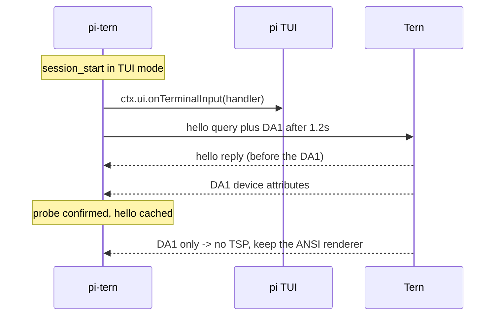

# Architecture

`pi-tern` is a single pi extension. It never writes TSP frames — it only sends the `hello` probe —
so pi's own ANSI renderer is never interfered with. Everything else goes through Tern's CLI or its
daemon relay.

## Module map

| Module | Responsibility |
| --- | --- |
| `index.ts` | extension factory: probe lifecycle, Phase A features, tools, `/tern` command |
| `lib/tsp.ts` | TSP v1 framing/parsing, `hello` encode, DA1 detection |
| `lib/tern.ts` | Tern detection (`TERM_PROGRAM`), `tern` CLI runner, scratch dir |
| `lib/relay.ts` | daemon relay client: one reconnecting connection, `u32LE + JSON` framing, request queue, `hello`/`welcome`, answer unwrap, idle close |
| `lib/events.ts` | `tern events` stream: line parsing, filters, `waitForEvent` |
| `lib/state.ts` | persisted state: mirror preference, last pinned diagram, control endpoint |
| `lib/browser.ts` | browser op validation, relay-first with CLI fallback |
| `lib/diagram.ts` | write a Markdown file, open it in a Tern file block (merman), pin support |
| `lib/ctl.ts` | pane capture, control-endpoint commands, pane listing |
| `lib/text.ts` | pure helpers: mermaid extraction, message rendering (unit-tested) |

## Probe lifecycle



- The reply is read only through `ctx.ui.onTerminalInput`; TSP-looking input is consumed, DA1
  replies belonging to the probe are absorbed, everything else passes through.
- `PI_TERN_PROBE=0` disables the probe; tmux/screen/zellij are never probed (APC is swallowed).

## Channels

1. **pty / TSP** — the `hello` probe. The extension does not open surfaces or send frames.
2. **daemon relay** (`$TERN_PANE_SOCKET`) — `{"hello":{}}` → `{"welcome":{}}`, then
   `{"id":N,"browser":OP}` → `{"id":N,"browser":ANSWER}` (the client unwraps `browser`).
   Falls back to `tern browser JSON --timeout N`.
3. **`tern` CLI** — `open` (diagram + mirror file blocks), `capture`, `ls --json`, `ctl`.

## Features

- **Title**: `ctx.ui.setTitle("π <model> · <ctx%> · <dir>")` on session start (re-applied after 3 s,
  because pi writes its own startup title) and on every `turn_end`.
- **Bell**: `PI_TERN_BELL=1` writes `\x07` to the pty at `agent_end`.
- **Diagrams**: `message_end` scans finalized assistant messages for ` ```mermaid ` fences; the
  newest is kept. `/tern diagram --last` writes it and opens it with
  `tern open --split right <file>`; `pin` reuses one file path so the same block updates.
- **Session mirror**: opt-in; renders finalized messages and tool events into
  `~/.pi/agent/scratch/pi-tern/session-mirror.md` (capped at ~200 KB) and opens it once as a file
  block. `/tern mirror open` re-focuses it.
- **Shell blocks**: `message_end` records the newest bash/sh fence (stripping `$ ` prompts).
  `tern_run` opens a keep-open pane (`tern new tab -- sh -lc …`), waits with
  `tern wait --until exit`, then captures the output; an existing pane can be targeted instead.
- **Pane output waits**: `tern_watch --expect` polls `tern capture` until a regex matches, for
  servers and builds that never "exit".
- **pi-bridge**: linked automatically on the first Tern session; the extension writes
  `dashboard.md` into the linked plugin directory, the plugin adopts its canvas by owner, renders
  the Markdown (mermaid + session TOC) and refreshes every 3 s while open.
- **Golden shots**: `tern_shot` runs `tern shot` with a scenario file (`size WxH`, `shot <name>`)
  and reports the PNG/layout files it produced.
- **ConPTY / multiplexers**: replies may arrive as OSC 877; `normalizeOsc877` converts them before
  parsing. Inside tmux/screen/zellij the probe is skipped because APC is swallowed.

## Events, control and restore

- **Events**: `tern_watch` starts one `tern events` child, parses JSON lines and resolves on the
  first match (`pane_exited` by default, optional pane filter, timeout). The stream is stopped when
  the call settles; nothing runs in the background.
- **Control**: `/tern control [window|headless]` spawns a detached Tern window (default) or
  `tern serve` bound to a socket under the scratch directory, waits until it answers and stores the
  endpoint in `state.json`. `tern_ctl` resolves an explicit override, then the stored endpoint, then
  `TERN_WINDOW_SOCKET`.
- **Restore**: `/tern mirror on|off` and pinned diagrams write to `state.json`; `/tern restore`
  reopens the mirror and the last pinned diagram. On session start the mirror restarts when
  `PI_TERN_MIRROR=1` or the persisted preference says it was on.

## Mailbox (extension ↔ plugin data plane)

The pi-bridge plugin runs in Tern's window VM; the extension runs in pi. They communicate over
two files in the linked plugin directory:

1. the extension writes `request.json` (`{id, op, args}`);
2. the plugin's 400 ms timer reads it, executes the `cx.*` operation and writes `response.json`;
3. the extension polls for the matching `id` and returns the result (timeout with guidance).

Ops: `system.ping`, `db.{tables,schema,query,exec}`, `doc.{read,outline,search,append,write,edit,newNote}`,
`board.{read,add,move,check,addLane}`, `settings.{get,list,describe}`, `notebook.read`,
`carly.{ask,schedule,tasks,cancel}`, plus `batch` (an array of ops in one round trip).
Read-only by default for databases; writes require an explicit flag. Responses carry the plugin
version; a window still running old plugin code fails with a clear restart message. A best-effort
claim file keeps two windows from running the same request, and a stale request older than 5 s is
discarded. The plugin caches up to 8 SQLite handles and polls every 250 ms (the extension polls
every 60 ms): measured median 252 ms per op, three batched ops in 251 ms.

Prompt footprint: five direct tools and fourteen `deferred` tools (callable from codemode by name) —
measured +1,309 tokens versus no extension, down from +3,679 when all tools were declared.

## What the extension deliberately does not do

pi 1.0.3 / `@earendil-works/pi-tui` expose no frame-provider seam, and their ANSI frames are
multi-write synchronized-output transactions with private cursor accounting. A foreign writer
tears frames, so this extension does not attempt TSP surfaces. Native Tern chrome (dock, composer,
transcript) requires a pi-tui back-port: additive seams for a DA1 probe, `setFrameProvider`, and
`Component.describe()`.
