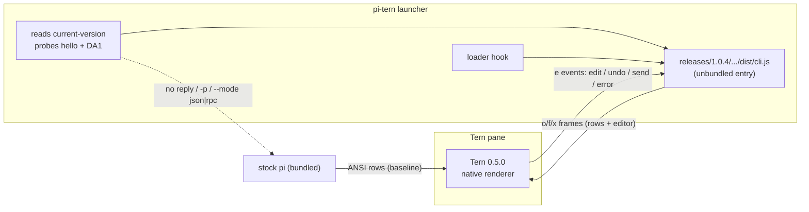

# pi-tern native mode — findings (v1.0.0)

Environment: managed pi **1.0.4**, **Tern 0.5.0 (ea43dbe)**, Node **26.10.0**, macOS.
Evidence files: `/tmp/pi-native6.jsonl` (first zero-error run), `/tmp/pi-native7.jsonl`
(M3 event round-trip), `/tmp/pi-native5.jsonl` (the failing pre-fix run).

## What native mode is



## Correction: M1/M2 claimed verification that was not real

The M1/M2 "verified live" evidence was the JSONL of frames **we sent**. Tern was rejecting every
frame of every run:

```
{"ev":"error","sf":"pi-…","s":1,"op":0,"msg":"unknown id main"}
{"ev":"error","sf":"pi-…","s":1,"op":1,"msg":"unknown id dock"}
```

The ops addressed the regions as parents (`["add","m","main",null,{…}]`), but Tern's own example
shows the regions are **root nodes added under the surface id**:

```json
["add","main","<surface>",null,{"id":"main","k":"col","c":[…]}]
["add","dock","<surface>",null,{"id":"dock","k":"col","c":[…]}]
```

The error events were on stdin and nothing read them, so the failure was invisible. **Native
mode rendered nothing before 2026-10-06.** M3's input interception exposed it; the tree was fixed
and the surface is now accepted with **zero error events**. The dock split (M2-lite) was also
affected: it had never rendered.

## M3 — verified end-to-end (Tern 0.5.0)

| Step | Evidence |
| --- | --- |
| Handshake | reply `{"r":"hello","v":1,"term":"tern","ver":"0.5.0"}`; features `blobs settle adopt dock program-palette reduce-motion aside scroll styles flow` |
| Surface tree | ops `add:main`, `add:dock`, `set:m`, `add:e`, `set:d`; **0 errors** |
| Native edit | injected `edit {from:0,to:0,text:"hello from tern"}` → `set e {text:"hello from tern",cursor:15,sendable:true}` |
| Native send | `send {text:"reply with exactly: NATIVE-OK"}` → pi submitted through its own path → model replied, `NATIVE-OK` in transcript rows, editor reset to `""` |
| Undo | `edit "abc"` → `set e "abc"`; `undo` → `set e ""` |
| Suspend / resume | frames `["suspend"]` (s=3) and `["resume"]` (s=5) |
| Input hygiene | TSP frames stripped from pty input; unknown events ignored; errors recorded |

## Tern 0.5.0 — what changed and how to use it

The hello reply advertises: **blobs, settle, adopt, dock, program-palette, reduce-motion, aside,
scroll, styles, flow** (protocol v1, same framing; no breaking change observed in our usage).

| Feature | Exploit |
| --- | --- |
| `adopt` | Reopen the closed inline surface on restart so the transcript continues in place (resume). Implemented **opt-in** (`PI_TERN_ADOPT=1`, stable `PI_TERN_SURFACE_ID=pi-<TERN_PANE>`); restart continuity not yet verified end-to-end. |
| `dock` | The pinned composer/status region (used). |
| `scroll` | `["scroll", id, …]` on transcript rows; main scrolls with the pane for inline surfaces. Not wired yet. |
| `flow` | Alternative surface mode for CLI output; inline stays right for pi. |
| `settle` | `["settle", id]` frees view state for unchanged transcript subtrees — a perf lever for long sessions. Not wired yet. |
| `blobs` + `image` | Native image rendering (pasted screenshots, capture PNGs) without ANSI art. Not wired yet. |
| `styles` (`s` verb) | Per-surface/region CSS (`.sf-main`, `.sf-dock`) to make the transcript match pi's theme. Not wired yet. |
| `aside`, `program-palette`, `reduce-motion` | Pane aside / palette integration / motion preference. Not wired yet. |

## Metrics (measured 2026-10-06, Tern 0.5.0)

| Metric | Value | Conditions |
| --- | --- | --- |
| ANSI writes in native mode | **0** | `PI_TUI_WRITE_LOG` never created |
| Handshake → first frame | **1,433 ms** | `/tmp/pi-native7.jsonl` timestamps (paint + sink) |
| Idle frames | **0 in 10 s** | coalescing (100 ms) + unchanged-frame skip |
| Child RSS | **238 MB** | pid 95115, `ps -o rss`; baseline ~260 MB (vault, different conditions) |
| Tests / coverage | **31/31**, 79.94 % lines | `npm test`, `npm run coverage` |
| Mailbox ping | median **186 ms** (125–514, n=10) | idle adaptive poll (250 ms); 66 ms was measured with the 100 ms active poll |
| Batch per-op | 63 ms | 3-op batch, one round trip |
| Compatibility | **7/7** | version, print, json, rpc, launcher fallbacks, zero TSP traffic outside Tern |
| Prompt delta | **+774 tokens** | n=3, cached prefix (unchanged by native mode) |
| Semantic nodes | editor + rows | transcript is still a rows mirror |

## Lessons

1. **Reading input is part of verification.** An output-only check ("frames sent") proves nothing
   about what the terminal accepted; the addressing bug survived two milestones.
2. **`listen:false` does not suppress `error` events in 0.5.0** (docs say it should). The surface
   emitted errors for every rejected op even though it announced it never reads input.
3. **`tern capture` does not expose inline TSP surfaces** — `--ansi` is 0 bytes (clean pane),
   `--surfaces --json` is `{"text":""}`. Verification is the TSP record plus event round-trips.
4. **Node 26 warns `module.register()` is deprecated** (DEP0205) and the warning reaches the pty;
   the launcher now spawns with `--disable-warning=DEP0205`.
5. **pi sets `process.title = "pi"`**, so `ps | grep node` cannot find the child; use
   `pgrep -P <launcher>`.
6. **`tern send BLOCK text …` writes raw bytes to the pty** — a practical way to inject TSP `e`
   events in tests without a Tern-side harness.
7. Tern does not check `s` ordering; error events carry `sf`, `s` and the 0-based `op` index, which
   is enough to rebuild state after a region is dropped.

## Known limits

- The transcript is a rows mirror (one `rows` node per frame), not semantic nodes (`md`, `tool`,
  `agent`, `diff`…); long-scroll retention and native text selection are not exploited yet.
- `adopt` is opt-in and its restart path is unverified end-to-end.
- No screenshot proof of the rendered surface (Screen Recording permission is not granted); the
  evidence is Tern's zero-error acceptance plus the event round-trip.
- Undo history is pi's own; an applied native `edit` is one undo unit as long as it goes through
  `setText`.
