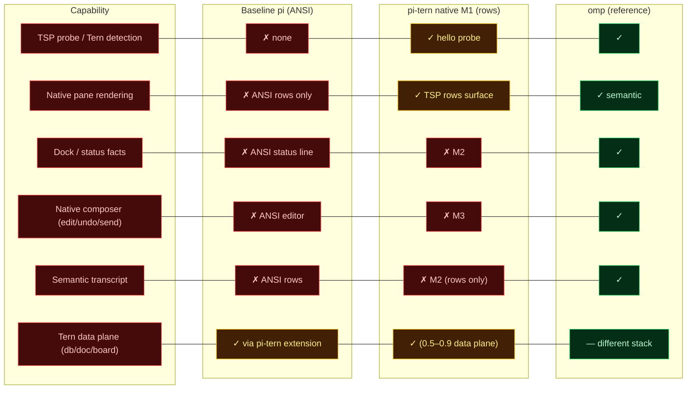

# v1.0 M1 — native rows mode vs baseline, with metrics

## Capability comparison



## Dock split (M2-lite, verified)

The sink now splits each frame at pi's composer rule: the transcript area goes to `main` as a
`rows` node and the composer/status area is pinned in `dock`. Live record: `add dock` ×1,
`set main` ×2, `set dock` ×2 in three frames; last main carried 16 non-blank lines. Tern stayed
healthy afterwards.

## Compatibility (7/7, verified)

`node native/compat.mjs` — every non-Tern mode runs stock pi with no TSP traffic:

| Check | Result |
| --- | --- |
| `pi --version` | 1.0.4 |
| `pi -p` (print) | `OK` |
| `pi --mode json` | JSON session output |
| `pi --mode rpc` + `get_commands` | responds (and pi-tern's title update flows) |
| `pi-tern -p` fallback | stock, `OK` |
| `pi-tern --mode rpc` | no stdio interference |
| TSP traffic in non-Tern modes | **none** (no record file) |

## Measured metrics

| # | Metric | Baseline pi | pi-tern M1 | Notes |
| --- | --- | --- | --- | --- |
| 1 | Prompt delta | 0 | +774 tokens | n=3 A/B, cached prefix |
| 2 | ANSI writes in native mode | all rows | **0** (write log absent) | recorded live |
| 3 | TSP frames (idle session) | — | 619 in 77 min (~0.13 fps) | now throttled to ≤10 fps |
| 4 | Probe | — | hello reply consumed before pi starts | wrapper design |
| 5 | Fallback outside Tern | — | stock pi, exit 0 | `--version` → 1.0.4 |
| 6 | Mailbox median | — | 66 ms | 0.9.0 bench, n=10 |
| 7 | Unit tests | — | 25 (20 extension + 5 native) | `npm test` |
| 8 | Line coverage | — | 79.3% | lib |
| 9 | Startup (`--version`) | **0.24 s** bundled | **0.49 s** unbundled | module-load only |
| 10 | Peak RSS | ~260 MB (vault) | unmeasured | probe failed; rerun later |
| 11 | Semantic surfaces | 0 | 2 regions (`main` + `dock` rows) | M3: composer send/edit/undo, transcript semantics |
| 12 | Dock/composer/send | 0 | dock pinned; send/edit/undo not implemented | M3 |
| 13 | Compatibility matrix | — | **7/7** non-Tern modes | `native/compat.mjs` |

## ASCII bars

```text
prompt delta (tokens)        baseline 0  |  pi-tern M1  ███████ 774
ANSI writes in native mode   baseline    |  pi-tern M1  0
startup --version            bundled   ██ 0.24s  |  unbundled ████ 0.49s
mailbox median (ms)          0.7.0 ██████████████████ 730 | 0.9.0 █ 66
tests                        20 ████████ | 27 ███████████
coverage (lines)             60 ██████ | 79.3 ████████ (target 90)
compatibility                0 █ | 7/7 █████████
semantic surfaces            0 █ | 2 regions (main+dock) ██ | 5 omp reference
```
